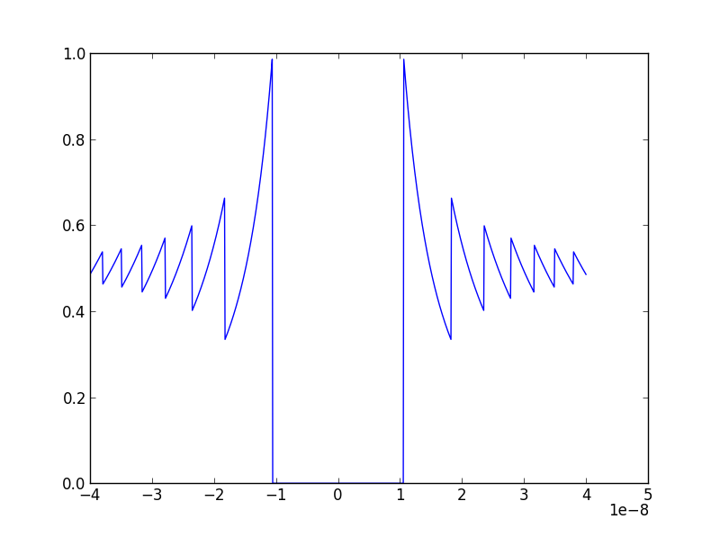

# Proyecto-0---Perdida-de-Significancia-CE
# MCOC-Proyecto-0

Introducción
==============

En este proyecto se busca demostrar como ocurre elefecto de perdida de significancia y el por que esta sucede. 

Ejemplo
==============

Aquí a modo de ejemplo ocupamos la funcion f(x)=(1-cos x)/(x* *2) y la graficamos entre (-4*10**-8,4*10**-8), de esta manera vemos el error que se produce en la parte del medio del grafico debido a la perdida de significacia, ya que  al entregarle un numero lo suficientemente pequeño a cos(x) y este resultado restarselo a 1 se generea un error por redondeo    

Resultados
==============

